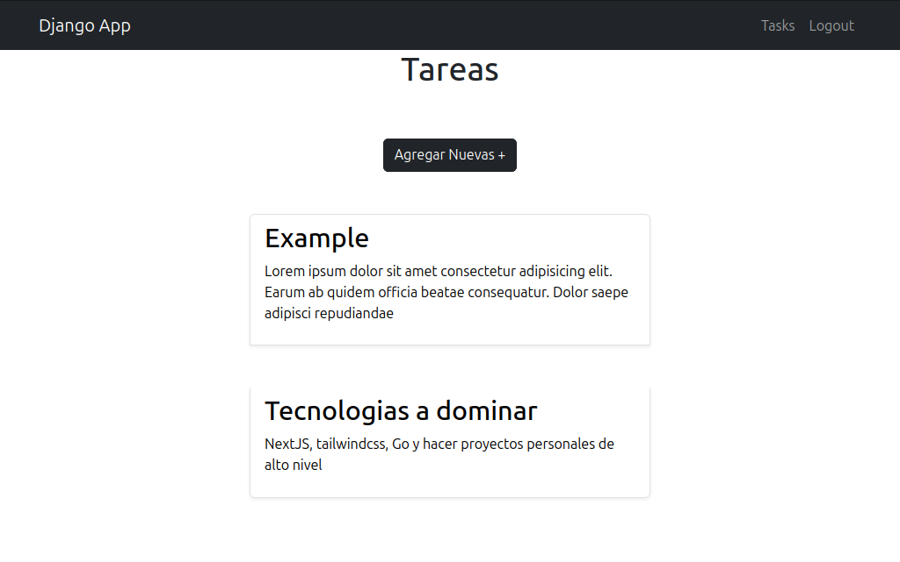
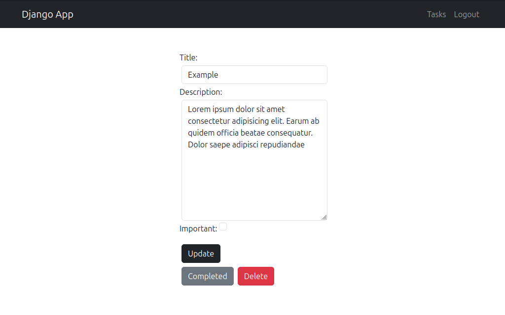

### Django Tasks App
Implementa formularios de django, modelos, conexion con base de datos, decoradores, cookies y templates. Ademas de usar entornos virtual con virtualenv o venv en el desarrollo



#### Run Command
```
pip install virtualenv
virtualenv env
```
Linux:
```
source ./env/bin/activate
```
Windows:
```
.\env\Scripts\activate
```
```
pip install -r requirements.txt
```

```
python manage.py runserver
```
